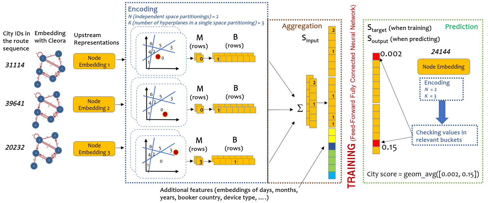

# Modeling Multi-Destination Trips with Sketch-Based Model

Implementation of our 2nd place solution to [Booking.Com Data Challenge Competition](https://www.bookingchallenge.com/). 
The aim of the challenge is to make the best recommendation for the next destination of a user trip, based on dataset with millions of real anonymized accommodation reservations.
First, we use [Cleora](https://arxiv.org/abs/2102.02302) - our graph embedding method - to represent cities as a directed graph and learn their vector representation. Next, we apply [EMDE](https://arxiv.org/abs/2006.01894) to predict the next user destination based on previously visited cities and some features associated with each trip.

An example of the full EMDE algorithm run is depicted in the figure below:

<p align="center"></p>

## Requirements
* Download binary [Cleora release](https://github.com/Synerise/cleora/releases/download/v1.1.0/cleora-v1.1.0-x86_64-unknown-linux-gnu). Then add execution permission to run it. Refer to [cleora github webpage](https://github.com/Synerise/cleora) for more details about Cleora.
* Python 3.7
* Install requirments: `pip install -r requirements.txt`
* GPU for training


## Getting Started

1. Download training set (`booking_train_set.csv`) from [challenge competition website](https://035105f7-ae32-47b6-a25b-87af7924c7ea.filesusr.com/archives/3091be_233bace50f3f48fba40547a89443a96e.zip?dn=booking_dataset.zip)
2. Split dataset into training and validation set that imitates the hidden test set:
    ```
    python train_valid_split.py --train booking_train_set.csv
    ```
    This script will create three files: `data/valid.csv`, `data/train.csv` and `data/ground_truth.csv`

3. Compute city sketches using [Cleora](https://github.com/Synerise/cleora) and [EMDE](https://arxiv.org/abs/2006.01894)
    ```
    python encoding.py --train data/train.csv --test data/valid.csv
    ```
    This script will create LSH codes for each city and save it into `data/codes`

4. Prepare dataset. Converting it from csv format to dictionary. Example datapoint looks like:
    ```
    {'checkout_last': Timestamp('2016-08-18 00:00:00'),
    'checkin_last': Timestamp('2016-08-16 00:00:00'),
    'day_in': 17,
    'day_out': 20,
    'month_in': 7,
    'year_in': 0,
    'checkout': Timestamp('2016-08-21 00:00:00'),
    'checkin': Timestamp('2016-08-18 00:00:00'),
    'cities': [8183, 15626, 60902],
    'utrip_id': '1000027_1',
    'device_class': 0,
    'affiliate_id': 1,
    'booker_country': 0,
    'num_cities_in_trip': 4,
    'hotel_country': 0,
    'is_target_last_city': True,
    'target': 30628}
    ```

    ```
    python data_preprocessing.py --train data/train.csv --test data/valid.csv --ground-truth data/ground_truth.csv
    ```
5. Training model
    ```
    python train.py
    ```
